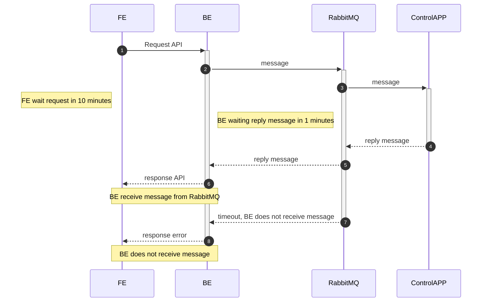
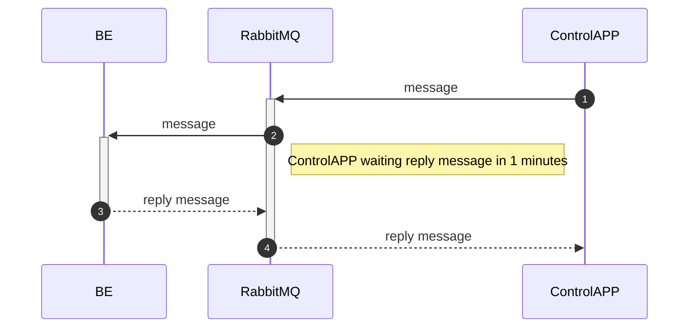

# Device test

Test device link for wincalx

## Design system

Flow 1: used in case with card



Flow 2: 3009, 3900,...



## Environment

To run this project, you will need to download dotnet 3.1.* from [here](https://dotnet.microsoft.com/download/dotnet/thank-you/sdk-3.1.407-windows-x64-installer) and run it as admin role


## Run Locally

Step 1: Clone the project

```bash
  git clone https://github.com/almexinc/wincalx-connector-dll.git
```

```bash
  git clone https://github.com/almexinc/wincalx-devicelink-simulator.git
```

Step 2: Go to the **wincalx-devicelink-simulator** folder

Step 3: Open **wincalx-devicelink-simulator.code-workspace** with vscode

Step 4: Open **terminal** in vscode (make sure that terminal path is **"{your path}\wincalx-devicelink-simulator"**)

Step 5: Run dotnet with vscode

```bash
  dotnet run
```
